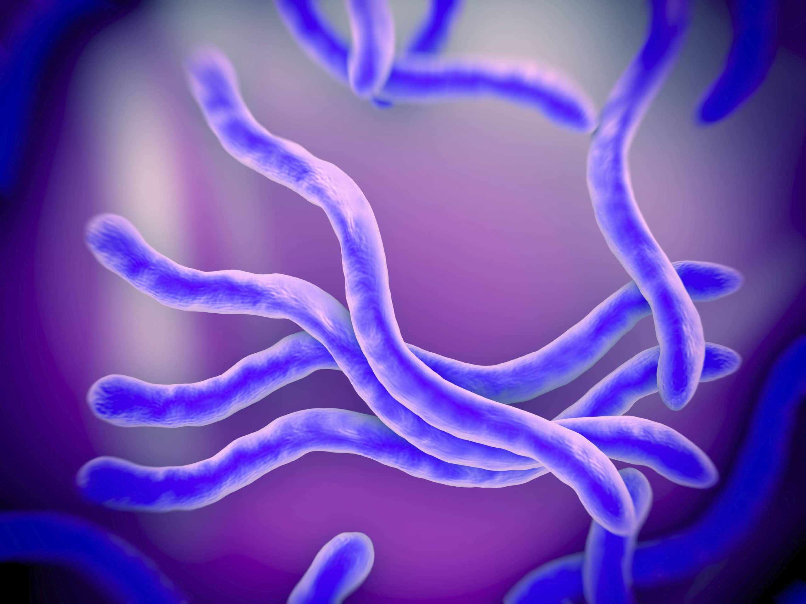

github repository: https://github.com/micahgrubert/Rentrez
```{r setup, include=F}
knitr::opts_chunk$set(echo = TRUE)
library(dplyr)
library(knitr) # load package for nicer tables
```

Creating a loop that outputs the counts of each nucleotide to a list specific to that nucleotide
```{r}
seqs<-read.csv("./Sequences.csv")

Adenine<- nchar(gsub("[^A]","",seqs$Sequence))
Thymine<- nchar(gsub("[^T]","",seqs$Sequence)) 
Guanine<- nchar(gsub("[^G]","",seqs$Sequence))
Cytosine<- nchar(gsub("[^C]","",seqs$Sequence))

basecounter<- data.frame(Name = seqs$Name, Adenine = Adenine,
                         Thymine = Thymine, Guanine = Guanine, Cytosine = Cytosine) #combine vectors creating new df

```

Print Sequence #1
```{r}
print(seqs$Sequence[1])
```

Print Sequence #2
```{r}
print(seqs$Sequence[2])
```

Print Sequence #3
```{r}
print(seqs$Sequence[3])
```

Combine vectors from earlier into a dataframe to make a nice table
```{r}
kable(basecounter, caption = "Nucleotide Counts for Borrelia burgdorferi 16s Genes")# create table
```



https://en.wikipedia.org/wiki/Borrelia_burgdorferi


```{r}
GC<- summarize("GC Content" = ((Guanine+Cytosine)/(Guanine+Cytosine+Adenine+Thymine))*100,basecounter) #calculate GC content

SeqID<- c("HQ433692.1","HQ433694.1","HQ433691.1") #create a vector of sequence IDs

GCtable<-data.frame("Sequence ID"=SeqID,"GC Content"=GC) #combine into a data.frame
kable(GCtable, caption = "GC Content (%) in Borrelia burgdorferi 16s Genes") #produce kable table

```

